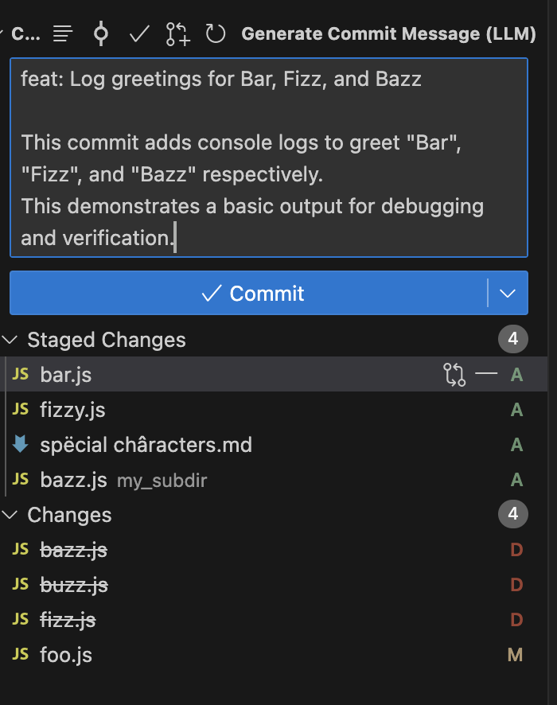

# LLM Commit Message (extension)
> Generate commit messages in VS Code using a local LLM

This extensions adds a button to the Git extension sidebar - clicking it sends a Git diff to a local LLM (default Ollama) and uses a generated commit message in the box.

## Benefits

- Free (does not require ChatGPT account and subscription)
- Secure (does not send your code over the internet)
- Choose from a server and model

## Documentation

See [docs](/docs/) for more details.

## Sample

## Related projects

- [MichaelCurrin/llm-commit-msg-py](https://github.com/MichaelCurrin/llm-commit-msg-py)
    > CLI tool to generate a commit message with an LLM then commit it

## License

Licensed under [MIT](/LICENSE).
